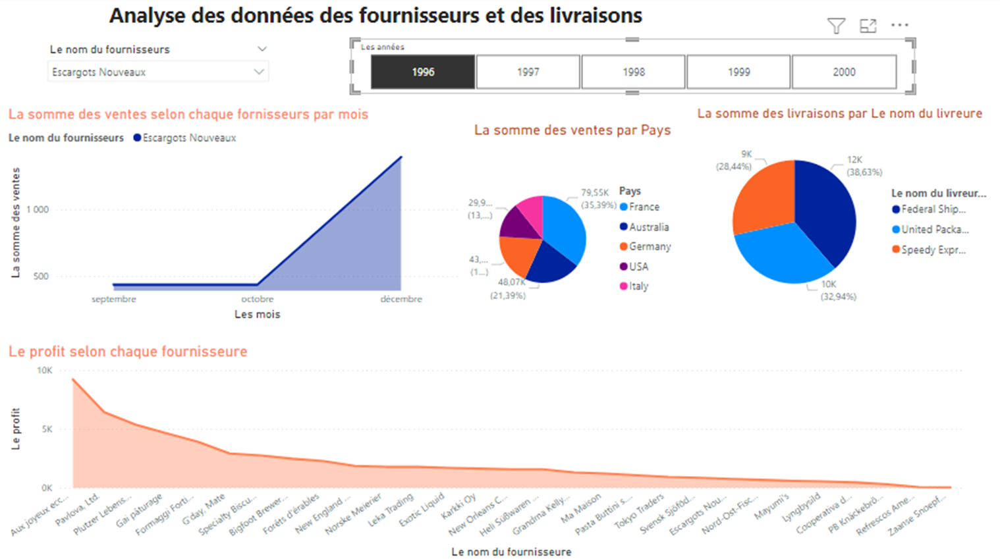

# datawarehouse_projet
Ce projet a pour objectif de visualiser les données stockées dans une base de données OLAP MySQL à l'aide de PowerBI. Les données ont été préalablement extraites, transformées et chargées (ETL) à partir d'une base de données OLTP en utilisant l'outil Talend.
Data Visualization with Power BI and ETL with Talend
#Overview
This project involves the creation of a data visualization dashboard using Power BI and the extraction, transformation, and loading (ETL) of data from an OLTP MySQL database to an OLAP MySQL data warehouse using Talend.
### screnshots :

# Data Sources
The source data for this project is stored in an OLTP MySQL database, which contains transactional data such as sales and customer information.
The destination data warehouse is an OLAP MySQL database, which stores data in a denormalized and optimized form for faster querying and analysis.
# ETL Process
Connect to the source OLTP MySQL database and the destination OLAP MySQL data warehouse using Talend.
Extract the relevant data from the source database using SQL queries.
Transform the data by applying various operations such as sorting, filtering, and aggregating.
Load the transformed data into the destination data warehouse.
Set up a scheduling system to automate the ETL process on a regular basis.
#Data Visualization with Power BI
Connect to the OLAP MySQL data warehouse using Power BI.
Use Power BI's drag-and-drop interface to create visualizations such as charts, tables, and maps.
Customize the appearance and layout of the dashboard using Power BI's formatting options.
Use Power BI's filtering and slicing capabilities to allow users to interact with the data and explore different perspectives.
# Design
We have paid special attention to the design of this dashboard, using a clean and modern look that is easy to read and navigate. We have also included relevant contextual information and captions to help users understand the data and its implications

# Conclusion
This project demonstrates the power of data visualization and ETL in creating insights and understanding from large and complex datasets. By using tools such as Power BI and Talend, we were able to transform raw data into meaningful and actionable information that can be used to drive business decisions. We hope that this dashboard will be a valuable resource for our users and that it will help them to make informed and data-driven decisions. Thank you for visiting our project.
